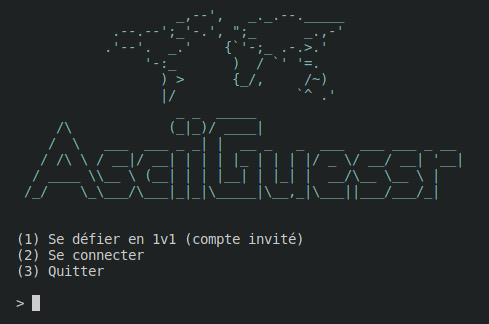
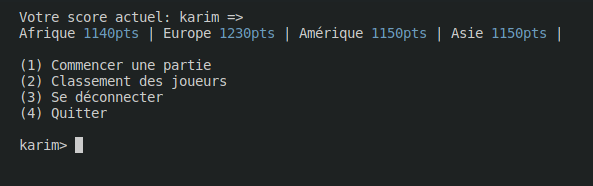

# AsciiGuessr

Développé par Karim AOULAD-TAYAB, Nassim BOUKEBOUT

Contacts : <karim.aouladtayab.etu@univ-lille.fr> , <nassim.boukebout@univ-lille.fr>

## Présentation de AsciiGuessr

Des captures d'écran illustrant le fonctionnement du logiciel sont proposées dans le répertoire shots.

Quelques illsustrations:





## Utilisation de AsciiGuessr

Afin d'utiliser le projet, il suffit de taper les commandes suivantes dans un terminal :

**Compilation des fichiers présents dans 'src' et création des fichiers '.class' dans 'classes'**

```
./compile.sh
```

**Lancement du jeu**

```
./run.sh AsciiGuessr
```
